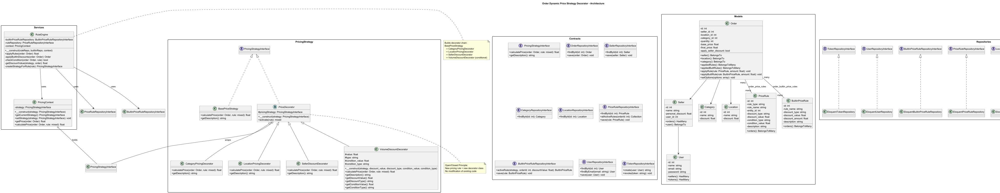

# Order Dynamic Price Strategy Decorator REST/API

> **REST API на основе Laravel для динамического расчёта цен с использованием паттернов Strategy/Decorator и аутентификацией через Sanctum**

[](https://github.com/sni10/price-calc-decorator/releases)
[](https://github.com/sni10/price-calc-decorator/actions/workflows/release.yml)
[](https://github.com/sni10/price-calc-decorator/actions/workflows/tests.yml)
[](https://github.com/sni10/price-calc-decorator/actions/workflows/tests.yml)
[](https://www.php.net/)
[](https://laravel.com)
[](https://www.docker.com/)
[](LICENSE)

## Key Feature: Universal Price Decorator

Главная архитектурная особенность — **универсальный декоратор цены** на базе паттерна Decorator + Strategy.

### Применение

Калькулятор подходит для любых продуктов с комплектациями:
- Металлопластиковые окна (профиль, стеклопакет, фурнитура)
- Автомобили (двигатель, трансмиссия, опции)
- Мебель на заказ (материалы, размеры, покрытия)
- Компьютеры (процессор, память, накопители)
- Любой конфигурируемый товар

### Цепочка декораторов

```
BasePriceStrategy
  → CategoryPricingDecorator (скидка категории)
  → LocationPricingDecorator (скидка региона)
  → SellerDiscountDecorator (персональная скидка)
  → VolumeDiscountDecorator (скидка за объём, условная)
  → ... (новые декораторы)
```

### Как добавить новый модификатор

1. Создать класс, наследующий `PriceDecorator`
2. Реализовать `calculatePrice()` — вызвать родительский, применить модификацию
3. Реализовать `getDescription()` — добавить описание к цепочке
4. Подключить в `RuleEngine`

```php
class MyNewDecorator extends PriceDecorator
{
    public function calculatePrice(Order $order, $rule = false): float
    {
        $price = $this->pricingStrategy->calculatePrice($order);
        // применить модификацию
        return $price * 0.95; // пример: -5%
    }

    public function getDescription(): string
    {
        return $this->pricingStrategy->getDescription() . " + My New Rule Applied";
    }
}
```

**Open/Closed Principle**: новое правило = новый класс, без изменения существующего кода.

## Architecture

Проект использует ключевые паттерны проектирования:

* **Repository Pattern** — каждый репозиторий отвечает за работу с конкретной сущностью и реализует общий интерфейс. Абстрагирует логику доступа к данным.
* **Strategy Pattern** — реализован через интерфейс `PricingStrategyInterface`. Позволяет динамически подменять логику расчёта цены.
* **Decorator Pattern** — декораторы расширяют базовую логику расчёта, добавляя модификации поверх существующих стратегий.
* **Rule Engine** — объединяет стратегии и декораторы для расчёта окончательной цены заказа.

| Компонент | Назначение |
|-----------|------------|
| [`PricingStrategyInterface`](app/Contracts/PricingStrategyInterface.php) | Интерфейс: `calculatePrice()`, `getDescription()` |
| [`BasePriceStrategy`](app/Services/PricingStrategy/BasePriceStrategy.php) | Базовая стратегия — возвращает `order.base_price` |
| [`PriceDecorator`](app/Services/PricingStrategy/PriceDecorator.php) | Абстрактный декоратор, принимает стратегию в конструктор |
| [`CategoryPricingDecorator`](app/Services/PricingStrategy/CategoryPricingDecorator.php) | Скидка по категории товара |
| [`LocationPricingDecorator`](app/Services/PricingStrategy/LocationPricingDecorator.php) | Скидка по региону доставки |
| [`SellerDiscountDecorator`](app/Services/PricingStrategy/SellerDiscountDecorator.php) | Персональная скидка продавца |
| [`VolumeDiscountDecorator`](app/Services/PricingStrategy/VolumeDiscountDecorator.php) | Условная скидка за объём (quantity > N) |
| [`RuleEngine`](app/Services/RuleEngine.php) | Собирает цепочку декораторов, применяет правила |
| [`PricingContext`](app/Services/PricingContext.php) | Контекст стратегии (Strategy Pattern) |



## Standards & Versions — MANDATORY

This project strictly follows the standards below. Contributions that do not meet these rules will not be accepted.

- Runtime/Framework:
  - PHP: 8.2.x (composer.json requires ^8.2)
  - Laravel: 11.x
  - PHPUnit: 11.x
- Coding Style: PSR-12 with Laravel preset (Laravel Pint)
  - Every PHP file MUST include: declare(strict_types=1);
  - Use modern PHP 8.2 syntax: constructor property promotion, union/nullable types, match, null coalescing, nullsafe, named arguments
  - DO NOT use legacy syntax: array() instead of [], ternary instead of null coalescing, sprintf where string interpolation is enough
- OOP/SOLID:
  - Single Responsibility, Open/Closed, Liskov, Interface Segregation, Dependency Inversion
  - Prefer composition over inheritance, validate configuration in constructors, avoid deep hierarchies
- Architectural patterns (STRICT):
  - Repository for data access (App\Contracts\*RepositoryInterface + App\Repositories\Eloquent*)
  - Strategy + Decorator for pricing (App\Services\PricingStrategy\...)
  - RuleEngine aggregates rule application

Automated style check/fix (inside php container):

```bash
composer run lint      # validate style with Pint (no changes)
composer run lint:fix  # auto-fix style
```

## Environments

Проект поддерживает два окружения, управляемых через Docker Compose:

### Production environment
- Использует `docker-compose.yml` как базовую конфигурацию
- Настроено для боевого развёртывания с оптимизированными параметрами
- Переменные окружения: `APP_ENV=prod`, `APP_DEBUG=false`
- База данных: `quote_price`

### Development / Testing environment
- Использует `docker-compose.yml` + `docker/config-envs/test/docker-compose.override.yml`
- Включает отладку, покрытие кода и подробные сообщения об ошибках
- Переменные окружения: `APP_ENV=test`, `APP_DEBUG=true`
- База данных: `quote_price`
- Xdebug включён для покрытия и отладки

## Running the Application

### Production
1. Клонируйте репозиторий:
```bash
git clone <repository-url>
cd price-calc-decorator
```

2. Создайте файл `.env` на основе `.env.example` с боевыми настройками

3. Соберите и запустите контейнеры:
```bash
docker compose build
docker compose up -d
```

4. API будет доступен по адресу `http://localhost:8000`

### Development / Testing
1. Создайте `.env.test` на основе `.env.example` с параметрами для test

2. Соберите и поднимите окружение с тестовым override:
```bash
docker compose --env-file .env.test -f docker-compose.yml -f docker/config-envs/test/docker-compose.override.yml build

docker compose --env-file .env.test -f docker-compose.yml -f docker/config-envs/test/docker-compose.override.yml up -d
```

3. API будет доступен по адресу `http://localhost:8000`

## Makefile

Для удобства доступны make-команды. По умолчанию `APP_ENV=test`.

```bash
make init                 # Полная инициализация (build + db + migrate)
make up / make down       # Запуск / остановка контейнеров
make test                 # Запуск тестов
make test-coverage        # Тесты с покрытием
make shell                # Bash в PHP-контейнере
make help                 # Список всех команд
```

Основные группы: `build`, `up`, `down`, `restart`, `logs`, `ps`, `shell` (Docker), `db-*` (БД), `test-*` (тесты), `artisan`, `composer-*`.

Production: `make prod-build`, `make prod-up`, `make prod-down`.

## Application composition (Services)
```
NAME      IMAGE              SERVICE   STATUS       PORTS
mysql     mysql:8.0.33       mysql     Up 2 hours   0.0.0.0:3306->3306/tcp
nginx     nginx:latest       nginx     Up 2 hours   0.0.0.0:8000->80/tcp
php       price-calc-php     php       Up 2 hours   9000/tcp
redis     redis:7.0.7        redis     Up 2 hours   0.0.0.0:6379->6379/tcp
```

### File structure diagram

<details>
  <summary>Показать структуру</summary>

```yaml
├── app/
│   ├── Contracts/
│   │   ├── BuiltinPriceRuleRepositoryInterface.php
│   │   ├── CategoryRepositoryInterface.php
│   │   ├── LocationRepositoryInterface.php
│   │   ├── OrderRepositoryInterface.php
│   │   ├── PriceRuleRepositoryInterface.php
│   │   ├── PricingStrategyInterface.php
│   │   ├── ProductRepositoryInterface.php
│   │   ├── SellerRepositoryInterface.php
│   │   ├── TokenRepositoryInterface.php
│   │   ├── UserRepositoryInterface.php
│   │   └── UserServiceInterface.php
│   ├── Http/Controllers/Api/
│   │   ├── AuthController.php
│   │   ├── OrderController.php
│   │   └── PricingController.php
│   ├── Models/
│   │   ├── BuiltinPriceRule.php
│   │   ├── Category.php
│   │   ├── Location.php
│   │   ├── Order.php
│   │   ├── PriceRule.php
│   │   ├── Product.php
│   │   ├── Seller.php
│   │   └── User.php
│   ├── Repositories/
│   │   ├── EloquentBuiltinPriceRuleRepository.php
│   │   ├── EloquentCategoryRepository.php
│   │   ├── EloquentLocationRepository.php
│   │   ├── EloquentOrderRepository.php
│   │   ├── EloquentPriceRuleRepository.php
│   │   ├── EloquentProductRepository.php
│   │   ├── EloquentSellerRepository.php
│   │   ├── EloquentTokenRepository.php
│   │   └── EloquentUserRepository.php
│   ├── Services/
│   │   ├── OrderService.php
│   │   ├── PriceRuleService.php
│   │   ├── PricingContext.php
│   │   ├── PricingStrategy/
│   │   │   ├── BasePriceStrategy.php
│   │   │   ├── CategoryPricingDecorator.php
│   │   │   ├── LocationPricingDecorator.php
│   │   │   ├── PriceDecorator.php
│   │   │   ├── SellerDiscountDecorator.php
│   │   │   └── VolumeDiscountDecorator.php
│   │   ├── RuleEngine.php
│   │   ├── SellerService.php
│   │   ├── TokenService.php
│   │   └── UserService.php
├── database/
│   ├── migrations/
│   ├── seeders/
│   │   ├── DatabaseSeeder.php
│   │   ├── UserSeeder.php
│   │   ├── CategorySeeder.php
│   │   ├── LocationSeeder.php
│   │   ├── SellerSeeder.php
│   │   ├── BuiltinPriceRuleSeeder.php
│   │   └── PriceRuleSeeder.php
├── docker/
│   ├── config-envs/test/docker-compose.override.yml
│   ├── nginx/test/
│   │   ├── default.conf
│   │   ├── php.ini
│   │   ├── php-fpm.conf
│   │   └── snippets/fastcgi-php.conf
│   └── entrypoint.sh
├── tests/
│   ├── Feature/AuthTest.php
│   ├── Unit/
│   │   ├── Services/PriceRuleServiceTest.php
│   │   └── UserTest.php
│   └── TestCase.php
├── .env.example
├── .env.test
├── Dockerfile
├── Makefile
├── docker-compose.yml
└── phpunit.xml
```

</details>

## Routes of group `api/v1`
```php
Route::prefix('v1')->group(function () {
    Route::post('/register', [AuthController::class, 'register']);
    Route::post('/login', [AuthController::class, 'login']);
    Route::middleware('auth:sanctum')->group(function () {
        Route::post('/logout', [AuthController::class, 'logout']);

        Route::get('/orders', [OrderController::class, 'index']);
        Route::post('/orders', [OrderController::class, 'store']);
        Route::get('/orders/{order}', [OrderController::class, 'show']);
        Route::post('/orders/{order}', [OrderController::class, 'update']);
        Route::delete('/orders/{order}', [OrderController::class, 'destroy']);

        Route::post('/calculate-price', [PricingController::class, 'calculatePrice']);
    });
});
```

## Authentication (Sanctum)
В дальнейшем предполагается расширение логики использования с распределением прав и полномочий для выдаваемых токенов

---

### Example request `http://localhost:8000/api/v1/register`
<details>
  <summary>Показать пример</summary>

```php
POST http://localhost:8000/api/v1/register
Content-Type: application/json

{
  "name": "MYNAME",
  "email": "admin@admin.com",
  "password": "content123"
}

Response {
  "access_token": "2|4BrtGfUhacVxSSMFYKiaX6LMmUuRQu7pxrm8aUXY2ac15ad4",
  "token_type": "Bearer"
}
```
</details>

### Example request `http://localhost:8000/api/v1/login`
<details>
  <summary>Показать пример</summary>

```php
POST http://localhost:8000/api/v1/login
Content-Type: application/json

{
  "email": "test@copy.com",
  "password": "password123"
}

Response {
  "access_token": "228|SEcZ4THB4BuakoQ8T4d8Ocn2xlCVc0tkYM4SJJK0bcf0e42b",
  "refresh_token": "180|abd1fcadb9120895c99de834129fef10e9c4c3538f265b95a8055f297f4e5871",
  "token_type": "Bearer"
}
```
</details>

### Example request `http://localhost:8000/api/v1/calculate-price`
<details>
  <summary>Показать пример</summary>

```php
POST http://localhost:8000/api/v1/calculate-price
Authorization: Bearer 229|hpGEnv0QcB95HQBejICxNsXo4n6Z4lxgHEsk0mId3a0496f8
Content-Type: application/json

{
  "order_id": 7,
  "category_id": 1,
  "location_id": 1,
  "quantity": 30,
  "base_price": 1000.0,
  "apply_seller_discount": 1
}

Response {
  "status": "success",
  "data": {
    "final_price": 787.3296,
    "order_id": 7,
    "applied_rules": [...],
    "bapplied_rules": [...]
  }
}
```
</details>

---

## Tests

Проект включает полноценное покрытие тестами на базе PHPUnit:
- **Unit-тесты** (`tests/Unit/`) — быстрые изолированные тесты для моделей и бизнес-логики (без БД)
- **Feature-тесты** (`tests/Feature/`) — интеграционные тесты для API-эндпоинтов с БД

### Running tests locally

Тесты запускаются внутри контейнера PHP, используя окружение разработки/тестирования.

1. Поднимите тестовое окружение:
```bash
docker compose --env-file .env.test -f docker-compose.yml -f docker/config-envs/test/docker-compose.override.yml up -d
```

2. Запустите все тесты:
```bash
docker compose --env-file .env.test exec php vendor/bin/phpunit --colors=always --testdox
```

3. Запустите тесты с покрытием:
```bash
docker compose --env-file .env.test exec php vendor/bin/phpunit --coverage-text --colors=always --testdox
```

4. Сгенерируйте HTML-отчёт покрытия:
```bash
docker compose --env-file .env.test exec php vendor/bin/phpunit --coverage-html=storage/coverage-report
```

Откройте `storage/coverage-report/index.html` в браузере, чтобы посмотреть отчёт.

### Running individual tests

Запустить один файл тестов:
```bash
docker compose --env-file .env.test exec php vendor/bin/phpunit tests/Feature/AuthTest.php
```

Запустить конкретный тестовый метод:
```bash
docker compose --env-file .env.test exec php vendor/bin/phpunit --filter=testRegistration
```

Запустить только Unit-тесты:
```bash
docker compose --env-file .env.test exec php vendor/bin/phpunit tests/Unit/
```

Запустить только Feature-тесты:
```bash
docker compose --env-file .env.test exec php vendor/bin/phpunit tests/Feature/
```

### CI/CD testing

Тесты автоматически запускаются в GitHub Actions при создании pull request. В пайплайне выполняется:
1. Сборка Docker-контейнеров с тестовой конфигурацией
2. Подготовка тестовой БД
3. Применение миграций и сидеров
4. Запуск всех тестов с покрытием
5. Загрузка отчётов покрытия как артефактов

Полную конфигурацию CI/CD смотрите в `.github/workflows/tests.yml`.

---

#### Sample test output

<details>
  <summary>Показать вывод</summary>

```shell
PHPUnit 11.4.1 by Sebastian Bergmann and contributors.

Runtime:       PHP 8.2.29 with Xdebug 3.4.7
Configuration: /var/www/phpunit.xml

.....                                                               5 / 5 (100%)

Time: 00:02.729, Memory: 42.00 MB

Auth (Tests\Feature\Auth)
 ✔ Registration
 ✔ Login
 ✔ Logout

Price Rule Service (Tests\Unit\Services\PriceRuleService)
 ✔ Calculate final price with location and category

User (Tests\Unit\User)
 ✔ User creation

OK (5 tests, 19 assertions)

Code Coverage Report:
 Summary:
  Classes:  8.57% (3/35)
  Methods: 19.87% (31/156)
  Lines:   26.84% (153/570)
```
</details>

---

## Git Workflow and Releases

### Branching Strategy
- `main` — production-ready code
- `stage` — Staging (pre-production)
- `dev` — интеграционная ветка разработки

### Release Process
1. Фичи разрабатываются в feature-ветках и вливаются в `dev` через pull request
2. Тесты автоматически запускаются на каждый PR в `dev` (см. `.github/workflows/tests.yml`)
3. Когда `dev` стабилен, создайте PR из `dev` → `stage`
4. После валидации `stage` создайте PR из `stage` → `main`
5. После мержа PR `stage` → `main` автоматически создаётся новый релиз с инкрементом версии (см. `.github/workflows/release.yml`)

### Automated Release Creation
- Триггерится при мерже PR из `stage` в `main`
- Автоматически увеличивается patch-версия (например, v1.0.0 → v1.0.1)
- Создаётся релиз GitHub с changelog
- Теги в формате семантического версионирования: `vMAJOR.MINOR.PATCH`

---

## License
MIT License — see [LICENSE](LICENSE) for details
